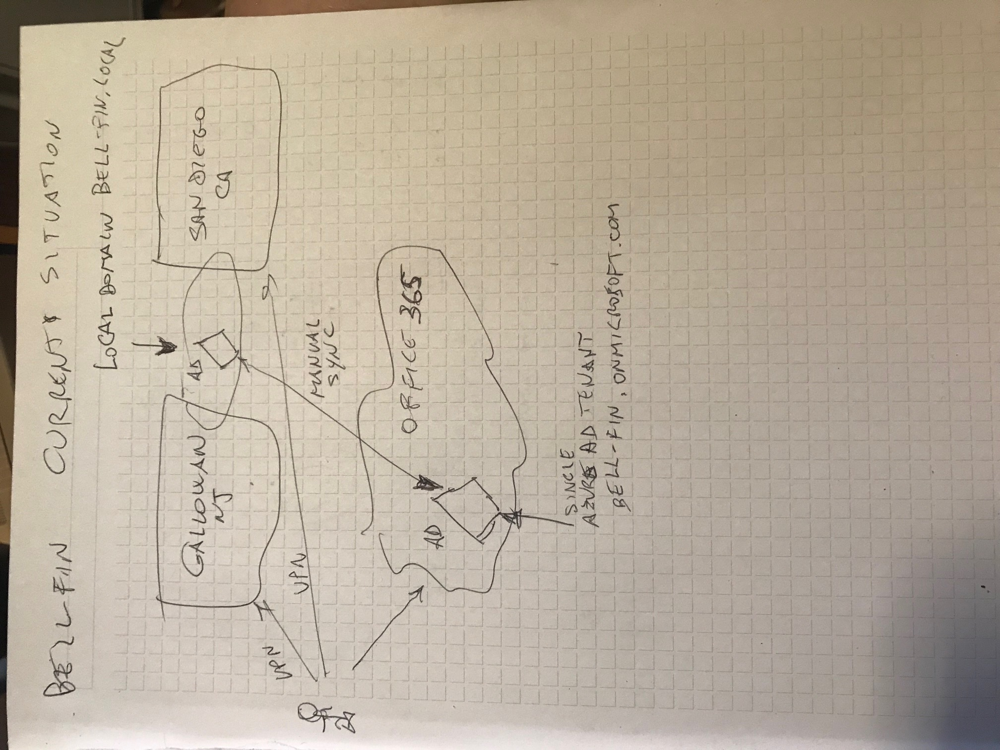

## Case description and current state

Bell-Fin JSC Overview:

    Company Profile: Bell-Fin JSC is a midsize financial company based in the USA,
    with headquarters in Galloway, NJ, and another office in San Diego, CA.

IT Infrastructure & Transition:

    Pre-COVID-19: The entire IT infrastructure was on-premises with Windows being the dominant platform. 
    All devices were using Windows 10, maintaining the latest build minus one.
    During COVID-19: To accommodate remote work, the company adopted Office 365 and other SaaS solutions. 
    Employees accessed internal systems via VPN, which didn't meet the granularity and endpoint security assessment needs of the IT and Information Security teams.

Identity and Access Management:

    AD Forest Design: Bell-Fin JSC has been using a single Active Directory Forest design 15 years ago. 
    While the directory's infrastructure is up-to-date, its internal domain naming convention (bell-fin.local) doesn't follow best practices.
    SaaS Account Management: When integrating Microsoft SaaS services and other SaaS solutions, user accounts were manually provisioned as per requests in a single Azure AD tenant (bell-fin.onmicrosoft.com).

Challenges & Concerns:

    Identity Management: There's a need to centralize and consolidate account management using their internal Active Directory.
    Security: The company faced challenges related to MFA enforcement, monitoring of compromised accounts, and blocking unsafe passwords.
    Password Reset: There were incidents involving successful social engineering attacks targeting the Help Desk staff due to issues with the remote password reset process.
    Device Compliance: The company desires to conditionally grant access based on both user authentication and the compliance state of their device.
    Partner Collaboration: Bell-Fin JSC is expanding partnerships, like with Vasil Brokers. They aim to provide access to their business apps to partners without compromising security or overburdening their helpdesk.

In essence, Bell-Fin JSC, post COVID-19, is seeking to upgrade and integrate their identity management solutions, address security concerns, and enhance their collaboration capabilities with partners while ensuring the robustness of their IT infrastructure.

## Business drivers and goals

Business Drivers:

    Business Continuity and Resilience: The company had to quickly adapt its business processes to SaaS solutions and remote access during the COVID-19 lockdown, highlighting the need for a resilient IT infrastructure that can adapt to unforeseen events.

    Expansion and Collaboration: Bell-Fin JSC is expanding its partner operating model, as shown by its partnership agreement with Vasil Brokers. This suggests a need for scalable and secure collaboration solutions.

    Security Concerns: The company has faced security challenges, such as social engineering attacks against Help Desk personnel and potential vulnerabilities in remote password reset processes.

    Operational Efficiency: The manual provisioning of users in various SaaS solutions indicates inefficiencies in their current processes. Streamlining and automating these processes can improve operational efficiency.

Business Goals:

    Centralized Identity Management: As the business returns to regular operations, there's a clear goal to consolidate the management of its employees' accounts based on the internal Active Directory.

    Enhanced Security: Bell-Fin JSC aims to:
        Implement and enforce multi-factor authentication (MFA) across VPNs, line-of-business apps, and other informational systems.
        Address concerns related to compromised accounts and weak password usage.
        Establish secure methods for password resets, reducing human-related risks.
        Ensure device compliance and secure access for business-critical operations.

    Business Agility: Ensure the company's infrastructure allows for seamless work, regardless of potential cloud service outages or issues with internal systems. This will provide flexibility and ensure operations aren't interrupted by IT disruptions.

    Efficient Partner Collaboration: Implement secure and manageable collaboration methods with partners like Vasil Brokers, without compromising security or placing undue burdens on internal resources.

In summary, Bell-Fin JSC's primary objectives revolve around improving IT resilience, security, operational efficiency, and enhancing collaboration capabilities, all underpinned by a strong emphasis on modern identity and access management solutions.

## Scope

Given the detailed description of Bell-Fin JSC's current state and requirements, the scope of the solution to their problems can be outlined as follows:

1. Identity Management & Synchronization

   Implementing a centralized system to synchronize and manage identities across on-premises AD and Azure AD.
   Transitioning from manual provisioning of users to an automated, unified system for both on-premises and cloud applications.

2. Active Directory Modernization

   Addressing the current non-best-practice naming convention of their AD domain (bell-fin.local).
   Ensuring all domain controllers and schema adhere to the latest and secure configurations.

3. Security Enhancements

   Enforcing Multi-Factor Authentication (MFA) for accessing VPN, line-of-business apps, and other key systems.
   Setting up mechanisms to detect and block compromised account activities and prevent the setting of insecure passwords.
   Implementing Azure AD Identity Protection for continuous monitoring of risks and providing appropriate responses.

4. Remote Password Reset

   Transitioning away from the existing remote password reset process, which is vulnerable to social engineering.
   Introducing Azure AD Self-Service Password Reset (SSPR) with strong identity verification mechanisms.

5. Endpoint Security and Compliance

   Ensuring secure access based on both user authentication and the compliance state of the accessing device.
   Implementing solutions like Intune to monitor and manage device compliance.

6. Emergency Access & Monitoring

   Creating provisions for emergency access to Azure AD without depending on external factors.
   Setting up robust monitoring and auditing systems for critical and elevated activities.

7. Partner Collaboration & Integration

   Setting up a secure and efficient B2B collaboration mechanism with partners like Vasil Brokers.
   Using Azure AD B2B, enabling partner users to authenticate using their native organization's credentials while Bell-Fin JSC provides an additional authentication layer.

8. Resilience & Business Continuity

   Ensuring uninterrupted work capability irrespective of cloud service outages or issues with the internal infrastructure.
   Implementing a hybrid solution, where cloud and on-premises resources back each other up in case of service disruptions.

9. Audit & Review

   Continuous monitoring of all the implemented solutions for optimization and security enhancements.
   Regular auditing and reviews to ensure alignment with best practices and evolving business requirements.

In essence, the solution scope aims to provide Bell-Fin JSC with a modern, secure, and efficient identity and access management system, coupled with enhanced security measures, improved partner collaboration mechanisms, and better business continuity solutions.

## Assumptions

Given the details provided on Bell-Fin JSC's situation, the following assumptions have been made:
1. Infrastructure Readiness

   Assumption: Bell-Fin JSC's existing infrastructure (hardware, network, software) can support the proposed hybrid identity and security solutions.
   Rationale: Implementing Azure AD and other cloud-based solutions require certain infrastructure prerequisites.

2. Domain Modernization

   Assumption: The company is willing to undergo a domain renaming or trust configuration process to align with best practices.
   Rationale: The use of the .local domain naming isn't recommended and may affect certain cloud functionalities.

3. Budget and Licensing

   Assumption: Bell-Fin JSC is prepared to invest in necessary licensing for Azure AD Premium features, Intune, or any other suggested tools.
   Rationale: Features like Azure AD Identity Protection, B2B collaboration, and Intune require premium licenses.

4. Training & Change Management

   Assumption: The company is open to training its IT staff and end-users on new tools, processes, and security measures.
   Rationale: Successful adoption of new technologies often requires education and training.

5. Stakeholder Buy-in

   Assumption: Key stakeholders, including top management and the security department, are supportive of the changes and will cooperate in the implementation phase.
   Rationale: Significant IT transformations often require approval and cooperation from multiple departments.

6. Data & Privacy Compliance

   Assumption: Transitioning to a hybrid model and storing some identity data in the cloud adheres to Bell-Fin JSC's compliance and regulatory requirements.
   Rationale: Financial institutions often face strict regulations regarding data storage and privacy.

7. Endpoint Device Types

   Assumption: The majority, if not all, of the endpoint devices accessing the corporate resources are Windows-based, given the information about Windows 10 migration.
   Rationale: Different endpoint OS types may require varied management solutions.

8. Partner Collaboration Readiness

   Assumption: Partner companies, like Vasil Brokers, have the IT capability and willingness to participate in the Azure AD B2B collaboration method.
   Rationale: B2B collaboration requires actions on both ends for successful implementation.

9. Existing Security Solutions

   Assumption: Bell-Fin JSC doesn’t already have other security solutions in place that could conflict with the proposed measures.
   Rationale: It's crucial to ensure compatibility and prevent overlaps in security solutions.

10. Backup & Recovery

    Assumption: The company has effective backup and disaster recovery solutions in place for their on-premises systems.
    Rationale: Hybrid solutions rely on both on-premises and cloud resources. If one fails, the backup and recovery processes become vital.

In the process of developing a detailed solution and planning the implementation, it's essential to validate these assumptions with Bell-Fin JSC to ensure accuracy and reduce risks.

## Risks

1. Implementation Complexity

   Probability: Medium
   Impact: High (Possible service disruptions, delays, or financial implications)
   Mitigation: Engage in thorough planning and phased deployment. Involve external experts or consultants familiar with the solution if needed.

2. User Adoption

   Probability: High
   Impact: Medium (Productivity drop, increased support tickets)
   Mitigation: Conduct training sessions, provide comprehensive user guides, and establish a support hotline to address queries.

3. Cost Overruns

   Probability: Medium
   Impact: Medium (Budgetary issues, possible reductions in other areas)
   Mitigation: Establish a clear budget from the outset, include contingencies, and ensure regular financial check-ins throughout the implementation.

4. Integration Issues

   Probability: Medium
   Impact: High (Disrupted workflows, data silos, reduced efficiency)
   Mitigation: Test integrations in a controlled environment before full deployment. Have backup systems in place.

5. Performance Concerns

   Probability: Low
   Impact: Medium (Reduced efficiency, user dissatisfaction)
   Mitigation: Regular system performance testing. Consider scaling or optimizing resources based on need.

6. Data Security & Privacy

   Probability: Low (given the attention to security in the proposal)
   Impact: Very High (Data breaches, financial implications, reputational damage)
   Mitigation: Regular security audits, employ end-to-end encryption, and continuously update security protocols.

7. Vendor Lock-in

   Probability: Medium
   Impact: Medium (Potential future migration costs, dependency on a single vendor)
   Mitigation: Ensure solutions are based on industry standards where possible and avoid proprietary protocols.

8. Regulatory & Compliance Implications

   Probability: Low (given the industry's known regulatory landscape)
   Impact: Very High (Legal consequences, financial penalties)
   Mitigation: Regular compliance checks and audits. Engage legal and compliance experts when implementing changes.

9. Backup & Recovery Challenges

   Probability: Low
   Impact: High (Data loss, service disruptions)
   Mitigation: Invest in robust backup solutions, regularly test disaster recovery plans, and keep offsite backups.

10. Partner Collaboration Complexity

    Probability: Medium
    Impact: Medium (Operational issues, potential misunderstandings or conflicts with partners)
    Mitigation: Clearly communicate expectations, provide training for partner IT teams, and have regular sync-up meetings.

11. Long-term Support and Maintenance

    Probability: Medium
    Impact: Medium (Unexpected downtimes, higher maintenance costs)
    Mitigation: Train in-house IT staff adequately, and consider long-term support agreements with solution providers.

12. Emergency Access Limitations

    Probability: Low
    Impact: Medium (Potential inability to access critical resources during emergencies)
    Mitigation: Regularly test emergency access protocols, maintain clear documentation, and ensure key personnel are trained.

Incorporating these probabilities, impacts, and mitigation strategies into the implementation plan can provide Bell-Fin JSC with a roadmap to navigate these potential challenges effectively.

## Tasks

When implementing a hybrid identity solution for Bell-Fin JSC, there will be several tasks that need to be accomplished. Here's a list of such tasks, along with their potential dependencies:
1. Infrastructure Assessment

   Task: Review the current state of Bell-Fin JSC's IT infrastructure to ensure compatibility with Azure solutions.
   Dependencies: None

2. Stakeholder Engagement

   Task: Meet with key stakeholders to understand their needs and gather requirements.
   Dependencies: None

3. Budget Allocation

   Task: Define and allocate budget for the implementation process.
   Dependencies: Stakeholder Engagement

4. Domain Modernization

   Task: Address the .local domain naming issue by either renaming or establishing trusts.
   Dependencies: Infrastructure Assessment

5. Azure AD Configuration

   Task: Set up and configure Azure AD to integrate with the on-premises Active Directory.
   Dependencies: Domain Modernization

6. User Migration

   Task: Migrate users from manual provisioning to Azure AD synchronization.
   Dependencies: Azure AD Configuration

7. MFA Implementation

   Task: Implement multi-factor authentication for VPN, apps, and other critical systems.
   Dependencies: User Migration, Azure AD Configuration

8. Emergency Access Setup

   Task: Set up emergency access protocols for Azure AD.
   Dependencies: Azure AD Configuration

9. Security Audit and Monitoring

   Task: Implement monitoring of compromised accounts and audit functionalities.
   Dependencies: Azure AD Configuration

10. Endpoint Compliance System Setup

    Task: Integrate an endpoint compliance check system for conditional access scenarios.
    Dependencies: Infrastructure Assessment

11. Training and Documentation

    Task: Provide training to IT teams and end-users. Create comprehensive user and admin guides.
    Dependencies: Almost all tasks above, especially User Migration and MFA Implementation

12. B2B Collaboration Setup

    Task: Establish Azure AD B2B collaboration for partner access.
    Dependencies: Azure AD Configuration

13. Backup and Recovery Strategy

    Task: Refine and test backup and recovery solutions in light of the hybrid setup.
    Dependencies: Azure AD Configuration, Infrastructure Assessment

14. Performance Testing

    Task: Test the performance of new solutions to ensure they meet business needs.
    Dependencies: Azure AD Configuration, Endpoint Compliance System Setup

15. Compliance Checks

    Task: Ensure that the new systems adhere to financial and data protection regulations.
    Dependencies: Stakeholder Engagement, Security Audit, and Monitoring

16. Final Review and Sign-off

    Task: Conduct a final review with stakeholders to ensure the solution meets all requirements and gain approval.
    Dependencies: All tasks above

Organizing these tasks and their dependencies in a Gantt chart or a similar project management tool can further aid in visualizing the timeline and sequencing for the implementation process.

## Constraints

Given the information provided on Bell-Fin JSC's situation, the following constraints can be inferred:
1. Legacy System Integration:

   Description: The company has a 15-year-old "one Active Directory Forest" design. Integrating modern systems with legacy architectures can be challenging.
   Implication: May require additional time or specialized expertise to ensure seamless integration.

2. Domain Name Limitation:

   Description: Bell-Fin JSC uses a .local domain name internally, which isn't recommended.
   Implication: Renaming the domain or establishing domain trusts might be necessary, which can add complexity to the project.

3. Continuity of Business Operations:

   Description: The solution must not disrupt the regular business operations during and post-implementation.
   Implication: Implementation may need to be done in stages or during off-peak hours to avoid disruption.

4. Remote Work Infrastructure:

   Description: Due to the pandemic, the company had to adapt to remote work. This setup must be retained and even enhanced.
   Implication: The new hybrid identity solution should not only cater to on-premises requirements but also remote access needs.

5. Regulatory and Compliance Boundaries:

   Description: As a financial company, Bell-Fin JSC would have stringent regulatory requirements related to data protection and user access.
   Implication: The solution must ensure it adheres to all industry-specific regulations.

6. Budgetary Constraints:

   Description: Implementing a new solution comes with costs. While the exact budget isn't specified, it's safe to assume there will be financial limitations.
   Implication: Cost-effective solutions might be preferred, and unexpected costs could pose challenges.

7. User Training:

   Description: Employees have been using the current system for a considerable time, and any new system will require them to adapt.
   Implication: Adequate training sessions and support systems need to be put in place, consuming time and resources.

8. Emergency Access Needs:

   Description: The company requires emergency access to Azure AD without any technical hurdles.
   Implication: This might constrain the types of security measures that can be put in place without complicating emergency access.

9. Partner Integration:

   Description: Bell-Fin JSC is expanding its partnership model, necessitating access for partners without compromising security.
   Implication: The identity solution must be adaptable to include partner organizations without extensive reconfiguration.

10. Internal Infrastructure Dependence:

    Description: The final solution should not make Bell-Fin JSC entirely dependent on cloud services for its operations.
    Implication: A true hybrid model needs to be implemented, ensuring operations can continue even if cloud services or internal infrastructure face issues.

Recognizing these constraints upfront can help Bell-Fin JSC make informed decisions and better plan the hybrid identity solution's implementation.

## Decisions 

1. Adopting Azure AD Connect for Synchronization

   Decision: Use Azure AD Connect to synchronize on-premises Active Directory with Azure AD.
   Justification: It provides a seamless integration between on-premises and cloud directories, ensuring that users have a consistent identity across resources.

2. Domain Strategy

   Decision: Instead of renaming the .local domain, establish trusts or use Azure AD B2B for external collaborations.
   Justification: Domain renaming is complex and risky. Establishing trusts or leveraging Azure B2B functionalities can work around the .local domain challenge without the inherent risks of domain renaming.

3. Multi-factor Authentication (MFA)

   Decision: Implement Azure MFA across VPN, critical applications, and data access.
   Justification: With the growing threats to financial firms, MFA offers an added layer of security by requiring two or more verification methods – something the user knows (password), something the user has (security token or phone), or something the user is (biometric verification).

4. Emergency Access Accounts

   Decision: Create dedicated emergency access accounts in Azure AD, ensuring they have minimal dependencies and are separate from standard user roles.
   Justification: It ensures that there's always a way to access essential resources in Azure AD during emergencies without the complications of regular security protocols.

5. Endpoint Compliance and Conditional Access

   Decision: Leverage Azure AD's conditional access policies based on endpoint compliance.
   Justification: This allows for granular control of resource access based on both user identity and the security posture of the accessing device, ensuring heightened security for business-critical resources.

6. Partner Collaboration using Azure AD B2B

   Decision: Use Azure AD B2B for collaborating with partners like Vasil Brokers, allowing them to use their credentials.
   Justification: Azure AD B2B enables external users to access company resources without being a member of the domain. This reduces the risks associated with external users while maintaining collaboration.

7. Password Reset with Self-Service Password Reset (SSPR)

   Decision: Implement Azure AD's SSPR for users.
   Justification: It automates the password reset process, reducing the load on the help desk and minimizing potential security issues arising from social engineering attacks.

8. Monitoring and Auditing with Azure AD Identity Protection

   Decision: Deploy Azure AD Identity Protection for real-time monitoring and mitigation of identity-based threats.
   Justification: It provides risk-based conditional access, detecting potential vulnerabilities and compromised identities, essential for a financial institution like Bell-Fin JSC.

9. Decentralized Authentication for Cloud Service Outages

   Decision: Retain on-premises authentication mechanisms in parallel with Azure AD.
   Justification: This ensures that in the event of cloud service outages, users can still authenticate and access resources using the on-premises infrastructure.

10. User Training and Support Strategy

    Decision: Organize comprehensive training sessions and establish a support mechanism for post-deployment issues.
    Justification: Changes in authentication processes can be disruptive. Proper training ensures smoother transition and user adoption, while support mechanisms handle any post-deployment queries or issues.

These design decisions, rooted in the unique needs and constraints of Bell-Fin JSC, help build a resilient, secure, and efficient hybrid identity system.

